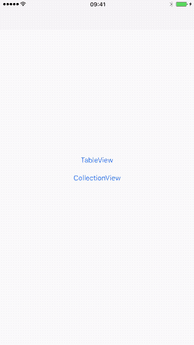

# ListUpdater
免去调用UITableView 和 UICollectionView 批量删除、插入、移动等动画接口需要进行Diff计算的麻烦。通过ListUpdater直接更新就可以实现动画刷新，内部做好了Diff计算。
>
>计算操作子线程执行
>
>内部实现节流更新，频繁调用也不会有问题
>
>使用简单，无需计算Diff
>
>可扩展
>

## Demo


## Installation
>
>PS: `swift版本还有问题，OC已经修复`
>
>Swift: pod 'ListUpdater'
>
>Objective-C: pod 'ListUpdater-OC'
>

## Usage
### 1.实现数据源
数据源实现Diff判断协议，Diffable对应Row/Item对应的数据源，SectionDiffable对应一个section对应的数据源,确保**`diffIdentifier`**能够区分不同的数据源

```swift
struct ViewModel : Diffable {
    var diffIdentifier: String = ""
}

struct Group : SectionDiffable {
    var diffIdentifier: String = ""
    var sectionItems:Array<Diffable> = [Diffable]()
}
```

### 2.使用数据源
TableView和CollectionView的delegate和dataSource中使用ListUpdater的数据源来获取数据。

```swift
override func numberOfSections(in tableView: UITableView) -> Int {
        return self.tableUpdater.dataSource.count
    }
    
    override func tableView(_ tableView: UITableView, numberOfRowsInSection section: Int) -> Int {
        return self.tableUpdater.dataSource[section].sectionItems.count
    }
    override func tableView(_ tableView: UITableView, cellForRowAt indexPath: IndexPath) -> UITableViewCell {
        let cell = self.tableView.dequeueReusableCell(withIdentifier: "cell", for: indexPath)
        let data = tableUpdater.dataSource[indexPath.section].sectionItems[indexPath.row]
        cell.textLabel?.text = data.diffIdentifier
        
        return cell
    }
    
    override func tableView(_ tableView: UITableView, titleForHeaderInSection section: Int) -> String? {
        let data = tableUpdater.dataSource[section]
        return data.diffIdentifier
    }
```

### 3.更新数据
在主线程直接调用updater的更新方法

```swift
self.tableUpdater.animateReload(newData: [Group]())
```


详细调用参见demo。
